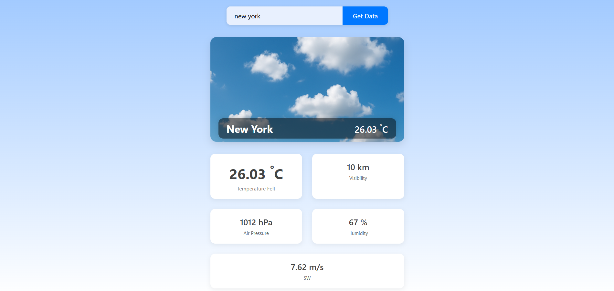

# Weather-Application
A simple, responsive weather application that fetches current weather data for any city using the OpenWeather API.

---

## Features

- Search weather by city name
- Displays city name, current temperature, temperature felt, visibility, air pressure, humidity, and wind speed
- Dynamic weather icon backgrounds based on current weather conditions
- Responsive design for desktop and mobile devices
- Supports input via button click and Enter key

---

## Technologies Used

- HTML5
- CSS3 (Responsive design)
- JavaScript (Fetch API and DOM manipulation)
- OpenWeatherMap API
---
## 💻 Demo

🌐 **[Live Demo Here](https://weather-ourdeepak.netlify.app/)**  

## 📸 Preview
  

---

## Acknowledgements

- OpenWeatherMap for the weather API
- Inspiration from various UI/UX resources for responsive design
